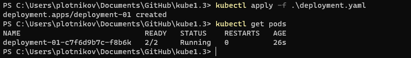

# Домашнее задание к занятию «Запуск приложений в K8S»

### Задание 1. Создать Deployment и обеспечить доступ к репликам приложения из другого Pod

1.Создать Deployment приложения, состоящего из двух контейнеров — nginx и multitool. Решить возникшую ошибку.
Проблема очевидна, ошибка будет по портам, так как мультитул тоже имеет nginx и пойдет на 80 порт, сразу смещаем порты у мультитула.

2,3. После запуска увеличить количество реплик работающего приложения до 2 и продемонстрировать до и после.

4.Создать Service, который обеспечит доступ до реплик приложений из п.1.

5.Создать отдельный Pod с приложением multitool и убедиться с помощью `curl`, что из пода есть доступ до приложений из п.1.

------

### Задание 2. Создать Deployment и обеспечить старт основного контейнера при выполнении условий

1,2. Создать Deployment приложения nginx и обеспечить старт контейнера только после того, как будет запущен сервис этого приложения. Убедиться, что nginx не стартует. В качестве Init-контейнера взять busybox.

3,4. Создать и запустить Service. Убедиться, что Init запустился.Продемонстрировать состояние пода до и после запуска сервиса.

